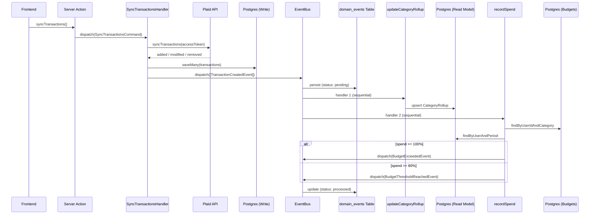
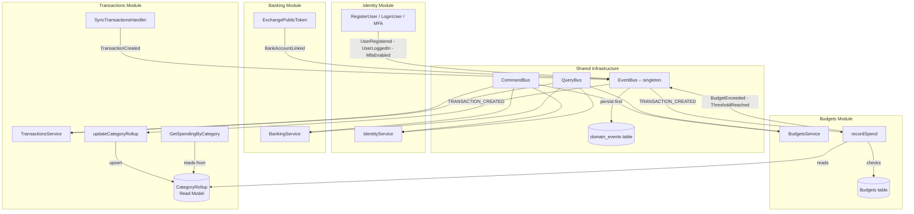
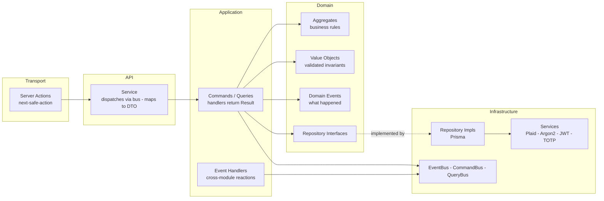
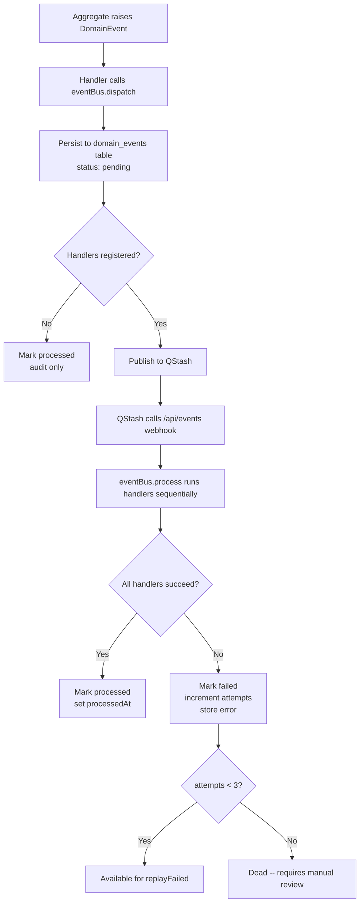
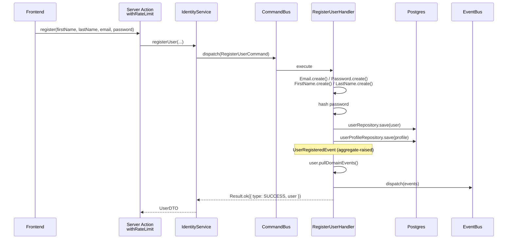
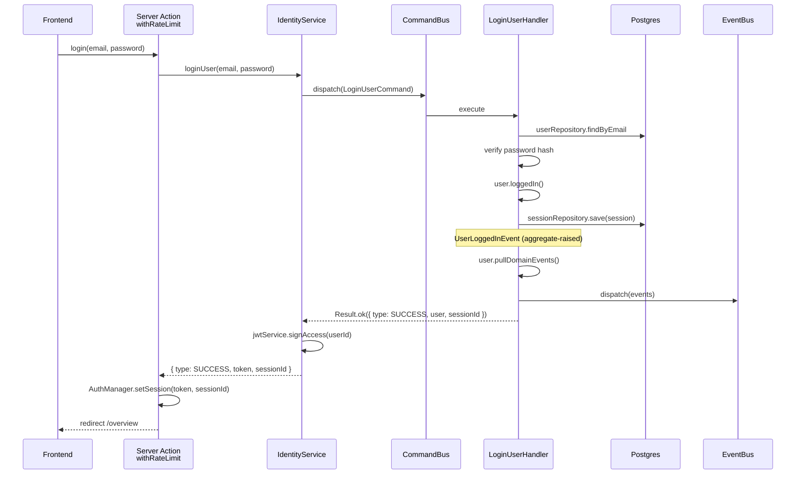
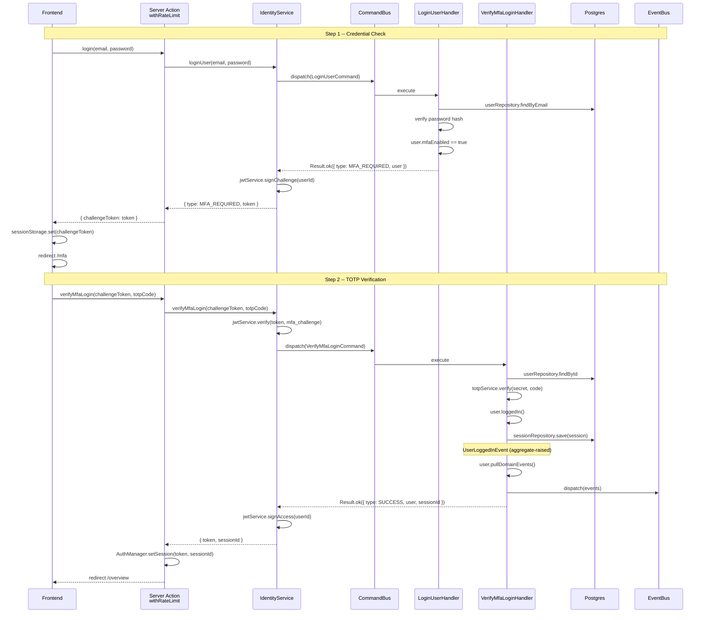
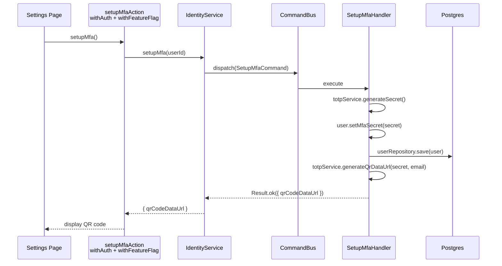
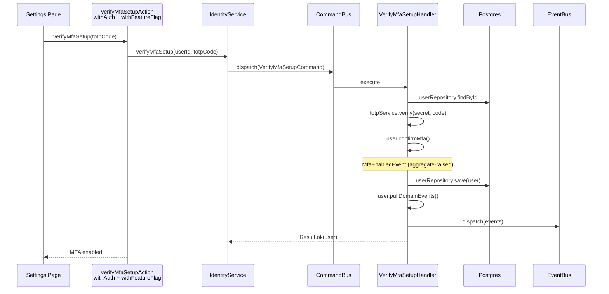

# System Flows

Visual diagrams of the key data flows and architectural boundaries in Ledger. Rendered natively by GitHub's Mermaid support.

---

## Transaction Sync --> Event --> Read Model --> Budget Check

The full end-to-end flow when a user syncs transactions from Plaid. Shows persist-first event dispatch to the event store, sequential handler dispatch, read model materialisation, and budget breach detection.



---

## Module Boundaries and Event Flow

How the four bounded contexts communicate through the shared event bus. Each module registers handlers during initialisation. Cross-module communication is event-driven -- no direct imports between module domains.



---

## Layered Architecture (Per Module)

Every module follows the same layer structure. Dependencies point inward -- domain has zero infrastructure knowledge. The transport layer is the only framework-coupled piece.



---

## Event Bus -- Persist, Publish, Process

The event lifecycle from aggregate to handler. Every event is persisted to Postgres, then published to QStash for async handler execution via a webhook. Failed handlers are tracked and retryable.



---

## Auth Flow -- Registration

The identity module's registration command flow from server action through to aggregate persistence and event dispatch.



---

## Auth Flow -- Login (No MFA)

When the user does not have MFA enabled, login completes in a single step. The handler raises `UserLoggedInEvent` via the aggregate, creates a `UserSession` in Postgres, and `IdentityService` signs the JWT. The action sets both cookies via `AuthManager.setSession()`. Feature flags are loaded lazily by the `withFeatureFlag` middleware on the first gated action, not at login time.



---

## Auth Flow -- Login (MFA Enabled)

When the user has MFA enabled, login is a two-step flow. The first step returns a short-lived challenge token. The client stores it in `sessionStorage` and redirects to `/mfa`. The second step verifies the TOTP code and completes login.



---

## MFA Setup Flow

MFA setup is a two-step process gated by `withAuth` and `withFeatureFlag(MFA)`. The first step generates a TOTP secret and returns a QR code. The second step verifies a TOTP code to confirm setup, raising `MfaEnabledEvent` from the aggregate.





---

## Feature Flag Flow

Feature flags follow a cache-aside pattern. The `withFeatureFlag` middleware checks the Upstash cache on every gated action. On cache miss (first access, TTL expired, or invalidated), it falls back to the database and repopulates the cache.

```mermaid
flowchart TD
    subgraph Login -- Cache Population
        L1[LoginUserHandler / VerifyMfaLoginHandler] --> L2[featureFlagRepo.findEnabledByTier]
        L2 --> L3[featureFlagCache.setFeatures<br/>Upstash]
    end

    subgraph Server Action -- Cache Check
        A1[Server Action] --> A2[withAuth middleware]
        A2 --> A3["withFeatureFlag(feature) middleware"]
        A3 --> A4{featureFlagCache.getFeatures}
        A4 -->|cache hit| A5{feature enabled?}
        A4 -->|cache miss| A6[identityService.getUserAccount]
        A6 --> A7[featureFlagRepo.findEnabledByTier]
        A7 --> A8[featureFlagCache.setFeatures]
        A8 --> A5
        A5 -->|yes| A9[proceed to action handler]
        A5 -->|no| A10[throw FeatureDisabledException]
    end
```

---

## Domain Event Inventory

Summary of all domain events, their ownership pattern, and dispatch origin.

| Event | Owner | Pattern |
|---|---|---|
| `UserRegisteredEvent` | `User.register()` | Aggregate-raised |
| `UserLoggedInEvent` | `User.loggedIn()` | Aggregate-raised |
| `UserProfileUpdatedEvent` | `UserProfile.updateName()` / `UserProfile.save()` | Aggregate-raised |
| `MfaEnabledEvent` | `User.confirmMfa()` | Aggregate-raised |
| `MfaDisabledEvent` | `User.disableMfa()` | Aggregate-raised |
| `BankAccountLinkedEvent` | `PlaidItem.create()` | Aggregate-raised |
| `BudgetCreatedEvent` | `Budget.create()` | Aggregate-raised |
| `TransactionCreatedEvent` | `Transaction.create()` | Aggregate-raised |
| `LoginFailedEvent` | `LoginUserHandler` | Handler-dispatched |
| `UserLoggedOutEvent` | `LogoutUserHandler` | Handler-dispatched |
| `AccountDeletedEvent` | `DeleteAccountHandler` | Handler-dispatched |
| `BankAccountUnlinkedEvent` | `UnlinkBankHandler` | Handler-dispatched |
| `BudgetExceededEvent` | `recordSpend` event handler | Handler-dispatched |
| `BudgetThresholdReachedEvent` | `recordSpend` event handler | Handler-dispatched |
| `SyncMismatchEvent` | `SyncTransactionsHandler` | Handler-dispatched |
