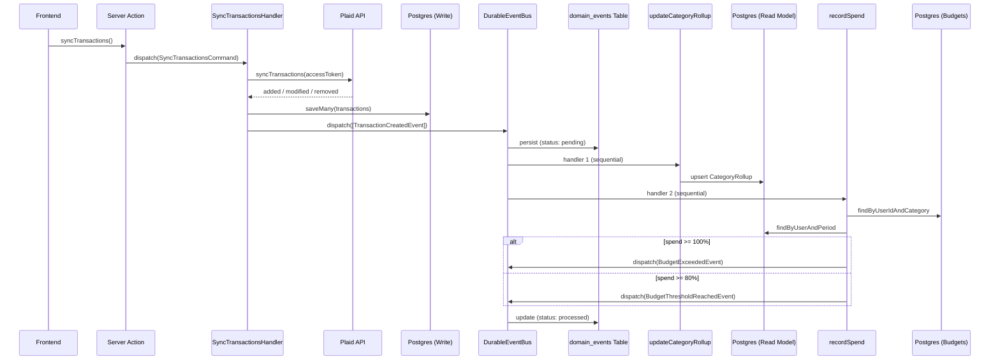
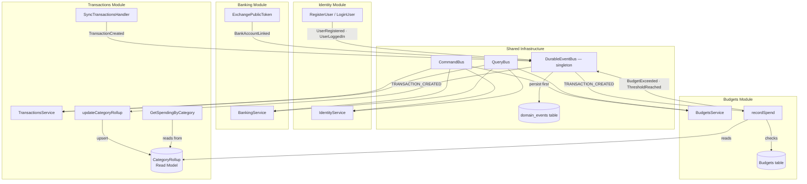
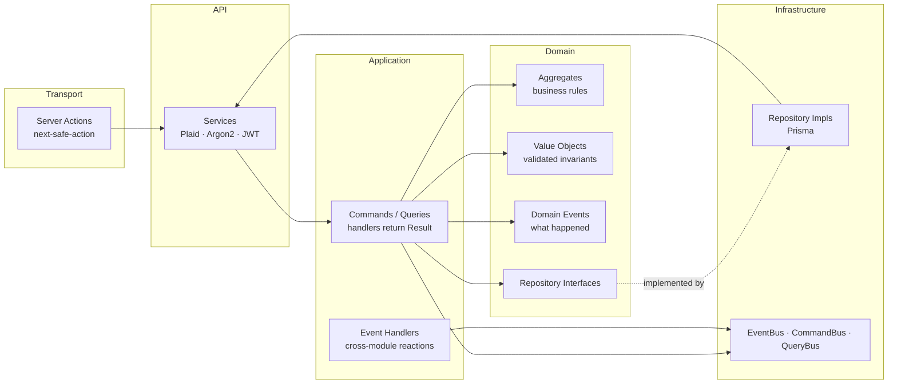
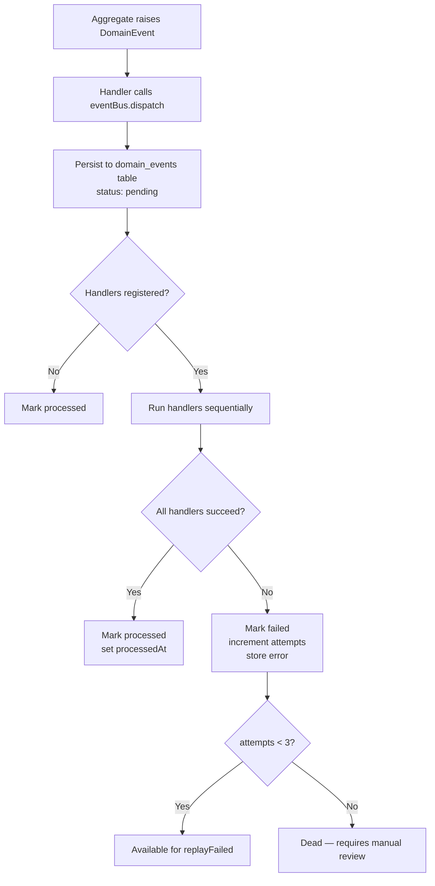
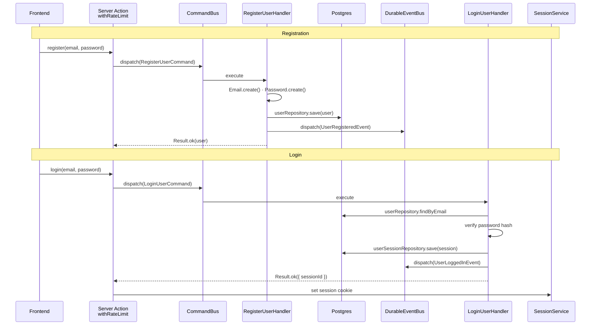

# System Flows

Visual diagrams of the key data flows and architectural boundaries in Ledger. Rendered natively by GitHub's Mermaid support.

---

## Transaction Sync → Event → Read Model → Budget Check

The full end-to-end flow when a user syncs transactions from Plaid. Shows the durable event bus persisting to the event store, sequential handler dispatch, read model materialisation, and budget breach detection.

---

## Module Boundaries and Event Flow

How the four bounded contexts communicate through the shared event bus. Each module registers handlers during initialisation. Cross-module communication is event-driven — no direct imports between module domains.

---

## Layered Architecture (Per Module)

Every module follows the same layer structure. Dependencies point inward — domain has zero infrastructure knowledge. The transport layer is the only framework-coupled piece.

---

## Durable Event Bus — Persist First, Dispatch Second

The event lifecycle from aggregate to handler. Every event is written to Postgres before any handler executes. Failed handlers are tracked and retryable.

---

## Auth Flow — Registration and Login

The identity module's command flow from server action through to session creation.

